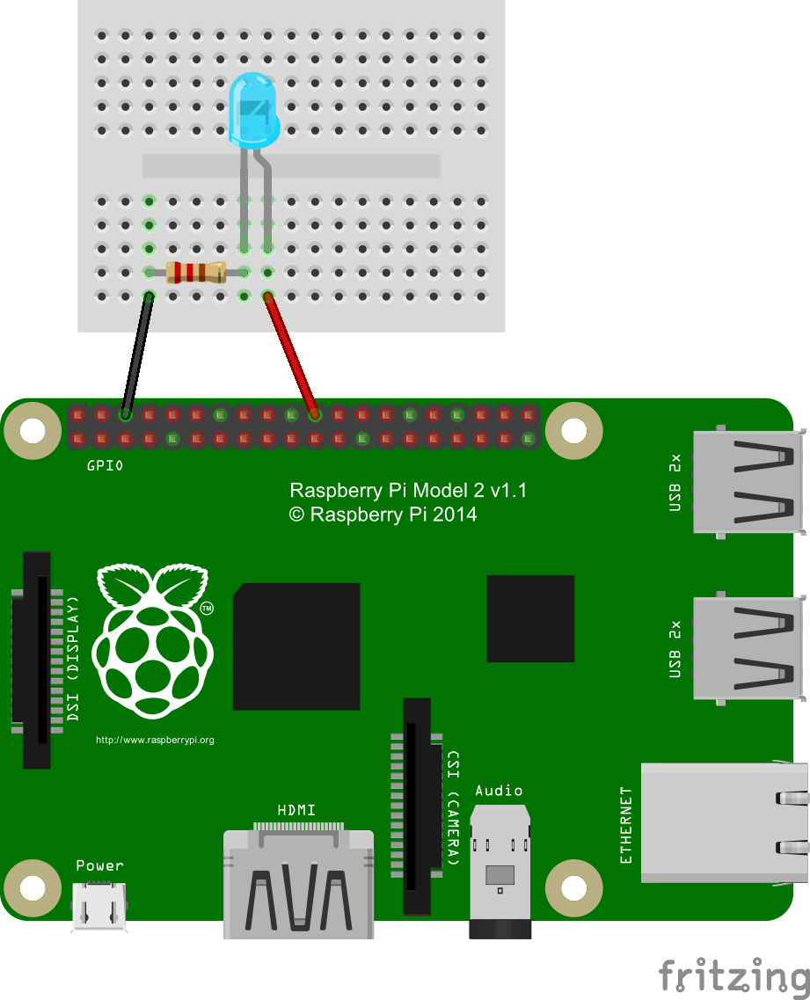

# Lesson 01 - Blink

When learning a new programming language one prints out the simple phrase 
"Hello, World!" When learning a new graphics library one draws a point on the 
screen. In electronics, one blinks an LED! This first lesson is exactly that, 
setting up the GPIO programming environment and learning how to turn a LED on 
and off.

## Setup

### What you need:

* 1 x Raspberry Pi (any model)
* 2 x Jumper Cables (female to male if not using a pi cobbler)
* 1 x Bread Board
* 1 x LED
* 1 x 220 ohm resistor
* (Optional) 1 x [Pi Cobbler](https://goo.gl/LhVmEg)

### Setting up your Environment

// setup

### Circuit
<div style = "display: block; margin-left: auto; margin-right: auto;">
	
</div>
<br>
The circuit of this lesson is fairly simple one. First, we use a jumper cable to
connect GPIO pin 25 to the anode of our LED. The LED picture above is a 505nm 
LED but any color LED will work. Next, connect the cathode of the LED to wither 
pin of the resistor. The resistor is necessary to regulate the amount of current
that flows through the LED, preventing the LED or the Pi from being damaged. The
resistor used here is a 220 ohm resistor, but any resistor, up to 1K ohm, will 
work. Finally we connect the free pin of the resistor to the ground pin on the 
Raspberry's GPIO.

## Code

```python
# Import the necessary files for GPIO use and sleeping the program.
import RPi.GPIO as GPIO
from time import sleep
```

The first thing we need to do is to import the proper GPIO files and as well as
the time class for pausing execution. Importing RPi.GPIO allows us to gain 
access to the GPIO functions necessary to control the GPIO, and importing it as 
GPIO makes it easier to remember later on. Secondly from the time class we can 
import the sleep method to pause execution while the LED is on or off.

```python
LED_PIN = 25
```

Next we declare a global variable for the pin on the Raspberry Pi's GPIO to 
which we will connect the LED.

```python
# Setup the GPIO pins for an output on LED_PIN.
def setup():
	print "Setting up GPIO"
	GPIO.setmode(GPIO.BCM)
	GPIO.setup(LED_PIN, GPIO.OUT)
```

The setup functions initializes the GPIO and sets the LED_PIN to an output. 
The function GPIO.setmode sets the way in which the GPIO pins are referenced.[1]
We will be using BCM which allows us to refer to pins by their label rather than 
their board numbers. GPIO.setup allows us to specify pin by number and whether
the pin should be used as output, GPIO.OUT, or input, GPIO.IN.

```python
# Loop through the blink cycle, Off -> Sleep(2) -> On -> Sleep(2) -> Off.
# Ends in the off state, but without a sleep after.
def loop():
	# LED OFF
	GPIO.output(LED_PIN, False)
	print "LED is OFF"
	sleep(1)
	
	# LED ON
	GPIO.output(LED_PIN, True)
	print "LED is ON"
	sleep(1)
	
	# LED OFF; NO SLEEP
	GPIO.output(LED_PIN, False)
```

The loop function acts as the core of our code. It is the function that we will
loop over and over turning the LED on and off. We use the function GPIO.ouput to
write out to a pin, setting it high or low. The function takes to arguments the
pin number, and a boolean for the state to put the pin in. False indicated low 
and True indicated high. The call line turns off the LED then the sleep function
waits one second and continues execution. The second call turns on the LED and
again the call to the sleep function pauses execution for one second. The last 
call to GPIO.output is just to make sure loop never leaves with the LED left on.

```python
# Main function for blink. Sets up then loops then cleans up.
def main():
	try:
		setup()
		while True:
			loop()
	except (KeyboardInterrupt, SystemExit):
		GPIO.cleanup()
		raise
```

Finally we get to the main controlling function of the program. Main simply 
calls the setup function and then loops indefinitely over the loop function. All
of this is inside of a try-except block so that we can catch any 
KeyboardInterrupts or SystemExist. By catching these exceptions when can clean 
up the GPIO, ensuring the GPIO and LED are turned off. GPIO.cleanup sets the 
pins to low and frees them up for other programs to use later on.

```python
# If being run directly.
if __name__=="__main__":
	main()
```

Lastly we use a bit of python magic to allow use to either run this script 
directly or import it in another python file with out running main 
automatically. The if statement check if this script is being run directly and 
if so calls main, beginning our blink loop.

## More

[Blink without a pause](https://goo.gl/0lCA6y) - An alternative program that 
blinks a LED without using the time.pause function.

## Next

[Lesson 02: Buttons](https://goo.gl/Oa1PJw)

## References

1. Read more [here](http://goo.gl/RpTCBO) for more information about 
GPIO.setmode and the different ways to reference GPIO's.
2. Read more [here](http://goo.gl/YZDurf) about why and how to use GPIO.cleanup.
