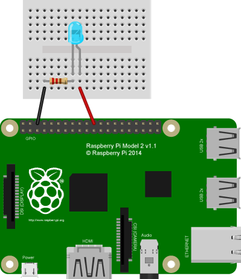

# Lesson 01 - Blink

When learning a new programming language you prints out the simple phrase 
"Hello, World!" When learning a new graphics library you draws a point on the 
screen. In electronics, you blinks an LED! This first lesson is exactly that, 
setting up the GPIO programming environment and learning how to turn a LED on 
and off.

## Setup

### What you need:

* Raspberry Pi (any model)
* Any color LED
* 220 ohm resistor
* Jumper Cables (female to male if not using a pi cobbler)
* Bread Board
* (Optional) [Pi Cobbler](https://goo.gl/LhVmEg)


### Setting up your Environment

In order to start using the GPIO pins in your python scripts you first need to 
install the GPIO library, RPi.GPIO. This module allows you to interact with the 
GPIO pin through function calls. The library is written in Python 2, but is 
compatible with Python 3, the version of Python used in these lessons.

To start with you need to update your repository list in order to get the newest
version. Do this by opening a terminal prompt and enter the following command:
```bash
sudo apt-get update
```
Now that your repository list is up to date, you can first install the Python 
Development toolkit. This toolkit is required by RPi.GPIO.

Install the tool kit by entering the following command in your terminal:
```bash
sudo apt-get install python-dev
```
Finally, to install the GPIO module enter the following command:
```bash
sudo apt-get install python-rpi.gpio
```
Confirm any prompts by entering 'Y'. 

Now you should have RPi.GPIO installed and updated, and you are ready to make 
your first project.

### The GPIO

// description of the GPIO layout

### The Circuit
<center>
	
</center>
<br>
The circuit of this lesson is fairly simple one. First, use a jumper cable to
connect GPIO pin 25 to the anode of the LED. The LED pictured above is a 505nm 
LED but any color LED will work. Next, connect the cathode of the LED to one of 
the resistors pins. The resistor regulates the amount of current that flows 
through the LED, preventing the LED or the Pi from being damaged. The resistor 
used here is a 220 ohm resistor, but any resistor, up to 1K ohm, will work. 
Finally, connect the free pin of the resistor to the ground pin on the 
Raspberry's GPIO.

## The Code

```python
# Import the necessary files for GPIO use and sleeping the program.
import RPi.GPIO as GPIO
from time import sleep
```

The first thing needed is to import the proper GPIO files and as well as the 
time class for pausing execution. Importing RPi.GPIO allows the program to 
access to the GPIO functions necessary to control the GPIO. By importing it as 
GPIO it is easier to reference later. From time the sleep function is imported 
in order to pause execution while the LED is on or off.

```python
# Constant for the pin to which the LED is plugged attached.
LED_PIN = 25
```

Next, a global variable is declared for the pin number on the Raspberry Pi's 
GPIO to which the LED is connected.

```python
# Setup the GPIO pins for an output on LED_PIN.
def setup():
	print("Setting up GPIO")
	GPIO.setmode(GPIO.BCM)
	GPIO.setup(LED_PIN, GPIO.OUT)
```

The setup functions initializes the GPIO and sets the LED_PIN to an output. 
The function GPIO.setmode sets the way in which the GPIO pins are referenced.
[[1]](#references) This program uses BCM which allows us to refer to pins by 
their label rather than their board numbers. GPIO.setup is used to specify a pin
number and whether the pin should be used as output, GPIO.OUT, or input, 
GPIO.IN.

```python
# Loop through the blink cycle, Off -> Sleep(2) -> On -> Sleep(2) -> Off.
# Ends in the off state, but without a sleep after.
def loop():
	# LED OFF
	GPIO.output(LED_PIN, False)
	print("LED is OFF")
	sleep(1)
	
	# LED ON
	GPIO.output(LED_PIN, True)
	print("LED is ON")
	sleep(1)
	
	# LED OFF; NO SLEEP
	GPIO.output(LED_PIN, False)
```

The loop function is the core of the code. It is the function that is loop over 
and over turning the LED on and off. It uses the function GPIO.ouput to write 
out to a pin, setting it high or low. The function takes two arguments: the
pin number, and a boolean for the state to put the pin in. False indicated low 
and True indicated high. The first line turns off the LED then the sleep 
function waits one second before continuing execution. The second call to output
turns on the LED and, again, the call to the sleep function pauses execution for 
one second. The last call to GPIO.output is just to make sure loop never leaves 
with the LED in the on state.

```python
# Main function for blink. Sets up then loops then cleans up.
def main():
	try:
		setup()
		while True:
			loop()
	except (KeyboardInterrupt, SystemExit):
		print("\nCleaning up GPIO")
		GPIO.cleanup()
		print("Exiting")
		exit()
```

Finally, the main controlling function of the program, main. Main simply calls 
the setup function and then loops indefinitely over the loop function. All of 
this is inside of a try-except block so that it can catch any KeyboardInterrupts
or SystemExist. By catching these exceptions the program can clean up the GPIO, 
ensuring the GPIO and LED are turned off, and exit cleanly. GPIO.cleanup sets 
the pins to low and frees them up for other programs to use later on.
[[2]](#references) 

```python
# If being run directly.
if __name__=="__main__":
	main()
```

Lastly is a bit of python magic that allow the program to either run directly or
to be import by another python script with out running main automatically. The 
if statement check if this script is being run directly and if so calls main, 
beginning the blink loop.

The script in its entirety can be viewed [here](./blink.py).

## More

[Blink without a pause](./blink_without_pause.py) - An alternative program that 
blinks a LED without using the time.pause function.

## Next

[Lesson 02: Buttons](../02-Button/Lesson02.md)

## References

1. Read more [here](http://goo.gl/RpTCBO) for more information about 
GPIO.setmode and the different ways to reference GPIO's.
2. Read more [here](http://goo.gl/YZDurf) about why and how to use GPIO.cleanup.
