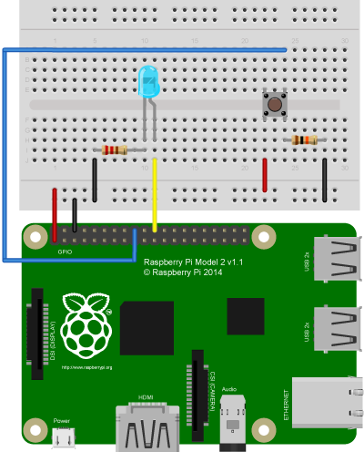

# Lesson 02 - Button

This lesson expands upon your knowledge of controlling devices through output by
including a physical input to control the state of an LED. Specifically, it 
shows how to use a tact or momentary switch to control the state, on or off, of 
an LED.

## Setup

### What you need:

* Raspberry Pi (any model)
* Any color LED
* Momentary button
* 10K ohm resistor
* 1K ohm resistor
* 220 ohm resistor
* Jumper Cables (female to male if not using a pi cobbler)
* Bread Board
* (Optional) [Pi Cobbler](https://goo.gl/LhVmEg)

### Setting up your Environment

See [setup in Lesson 01](../01-Blink/Lesson01.md#setting-up-your-environment).

### The Circuit
<center>
	
</center>
<br>
The circuit needed in this lesson is an extension upon the one used in 
[Lesson one](../01-Blink/Lesson01.md#the-circuit), so begin by setting up the 
same circuit on your bread board. 

Once the LED circuit is set up, start by connecting the +3.3V and ground pins to 
the rails of the bread board, the bottom two rows. Here the red wire indicated 
the 3.3V line and the black wire indicates ground. Unlike the vertical columns, 
the pins of horizontal rails are connected with the pins in the same row. This 
allows you to connect all +3.3V pins to the same row and, similarly, it allows 
you to connect all ground pins to the ground rail.

Next, place your button on the board and connect one column to the +3.3V rail. 
The columns of momentary buttons are connected to each other, so the columns of 
the bread board are connected across the gap via the button. Now, use a 10k ohm 
resistor to connect the button to ground. This resistor acts as a pull-down 
resistor, a resistor that holds the voltage of the column down to ground when 
the button is not pressed. This prevents the voltage value of the pin from 
"floating," or varying between ground and +3.3V.[[1]](#references) 

Finally, connect the ground column of the button to pin number 24 on the 
Raspberry Pi via a 1k ohm resistor. This resistor prevents damage to the Pi if 
the pin is mistakingly set to output instead of input. If this mistake is made 
it could result in a short circuit on your board causing damage to the Raspberry
Pi since the pins are not voltage protected.

## The Code

The code for this lesson utilizes the knowledge learnt from 
[Lesson 01](../01-Blink/Lesson01.md). Review that lesson for more details.

```python
# Constant for the pin to which the LED is plugged attached.
LED_PIN = 25
# Constant for the pin to which the button is plugged attached.
BUTTON_PIN = 24
```
First, a new pin constant is declared for the pin to which the button is 
connected.

```python
# Setup the GPIO pins for an output on LED_PIN.
def setup():
	print "Setting up GPIO"
	GPIO.setmode(GPIO.BCM)
	GPIO.setup(LED_PIN, GPIO.OUT)   # Set the LED pin as an output.
	GPIO.setup(BUTTON_PIN, GPIO.IN) # Set the button pin as an input.
```
The new pin number is then used to setup the pin as an input. Similar to 
GPIO.OUT, GPIO.IN indicates the way the pin is used, in this case as an input.

```python
# Loop function for the program that reads the state of the button then writes 
# the state to the LED.
def loop():
	# Get the state of the button.
	buttonState = GPIO.input(BUTTON_PIN)
	 # Set the LED to the same state as the button.
	GPIO.output(LED_PIN, buttonState)
```
Next the loop function is used to get the state of the button using GPIO.input,
and then, this state is written out to the LED. So, for example, if the buttons 
state is HIGH the LED turns on. The GPIO.input function takes one argument,
the pin number for the pin to read the value from. It then returns either True
or False for High or Low respective. In this case the button state is False when
the button is not pressed and True when it is pressed.

The remainder of the code is the same as in 
[Lesson 01](../01-Blink/Lesson01.md#the-code), and the entire script can be 
viewed [here](./button.py).

## Next

[Lesson 03: Sensors](../02-Sensors/Lesson03.md)

## References

1. Learn more about pull up and pull down resistors 
[here](http://playground.arduino.cc/CommonTopics/PullUpDownResistor).