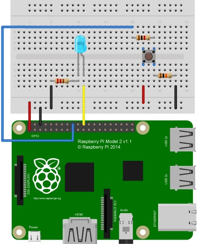

# Lesson 02 - Button

In this lesson we will expand upon our knowledge controlling device through 
output by including a physical input to control the state of an LED. 
Specifically we will use a tact or momentary switch to control when an LED turns
on and off.

## Setup

### What you need:

* 1 x Raspberry Pi (any model)
* 4 x Jumper Cables (female to male if not using a pi cobbler)
* 5 x Bread Board
* 1 x LED
* 1 x Tack switch
* 1 x 10K ohm resistor
* 1 x 40K ohm Resistor
* (Optional) 1 x [Pi Cobbler](https://goo.gl/LhVmEg)

### Setting up your Environment

See [setup in Lesson 01](../01-Blink/Lesson01.md#setting-up-your-environment).

### Circuit

	

## The Code